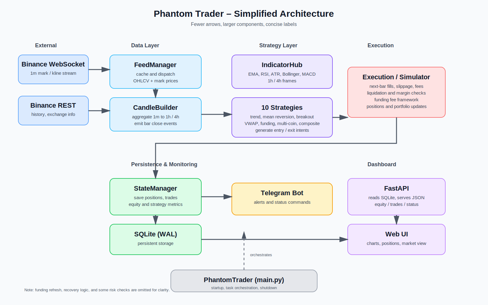
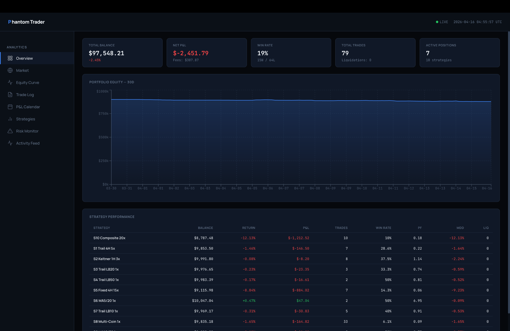
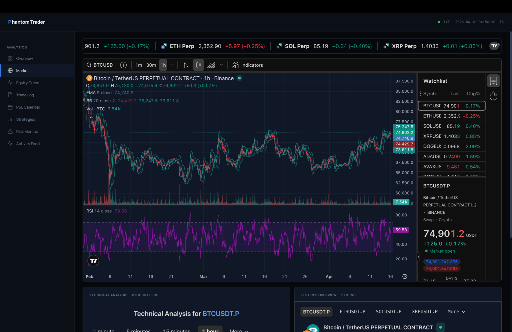
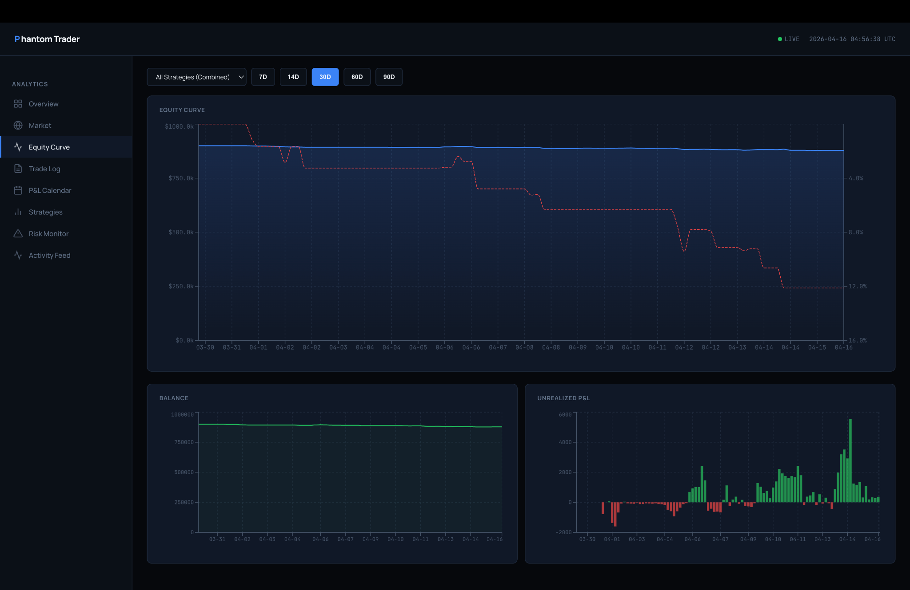
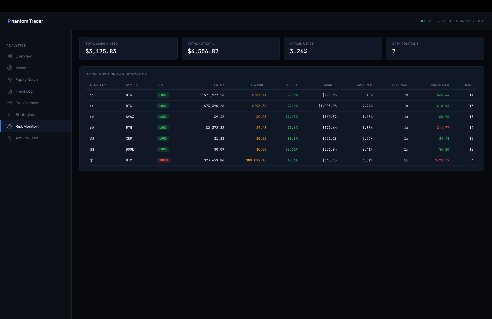
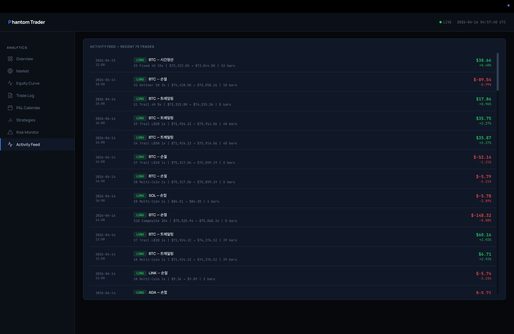
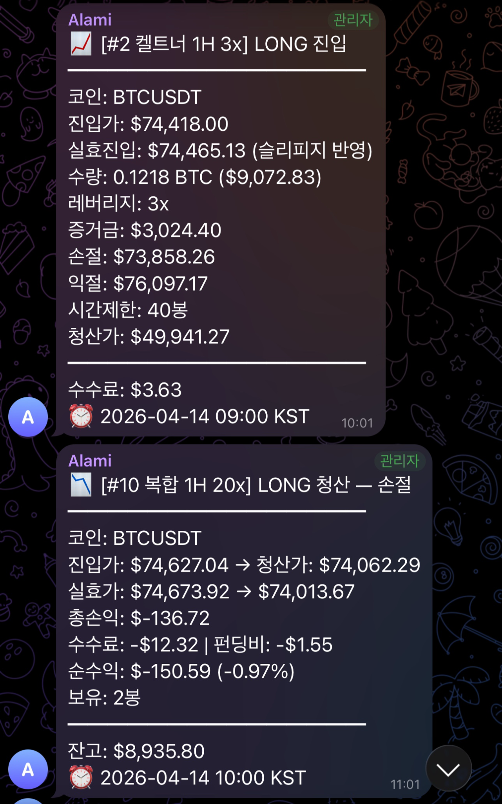
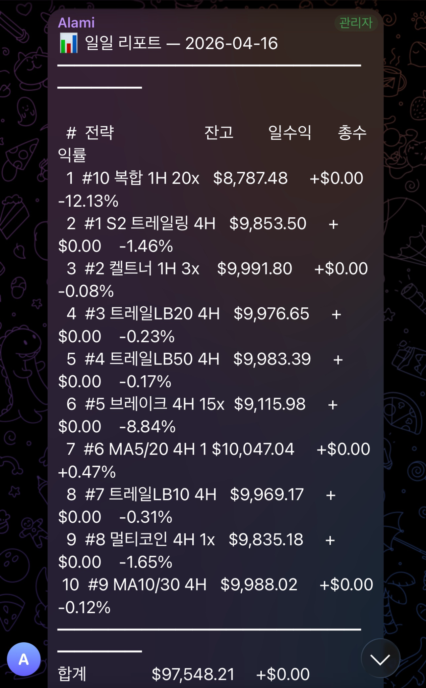

# Phantom Trader

**Phantom Trader** is an asynchronous paper-trading system for Binance Futures market data.  
It is designed as a **long-running, real-time decision system** rather than a simple backtesting script.

The project combines live market-data ingestion, concurrent strategy execution, execution-cost simulation, persistent state management, Telegram notifications, and a FastAPI dashboard for observability.

---

## Project Summary

The current public repository runs **10 independent strategy configurations** on top of a shared event-driven architecture:

- Python 3.11+
- `asyncio`-based orchestration
- Binance **1-minute WebSocket** market-data stream with **REST-based historical preload**
- Higher-timeframe candle generation (`1h`, `4h`) for strategy evaluation
- Multi-strategy paper trading (10 configurations)
- Realism-oriented execution simulator (slippage, fees, funding fallback, liquidation checks)
- SQLite persistence in WAL mode
- Telegram alert pipeline and command interface
- FastAPI dashboard with a browser frontend
- Linux / `systemd`-oriented deployment workflow

---

## Why this project matters

This repository was built to explore **real-time autonomous decision-making under uncertainty**.  
Although the domain is paper trading, the engineering focus is broader:

- concurrent autonomous agents
- streaming data processing
- stateful decision loops
- fault-tolerant long-running services
- observability for live systems

---

## Architecture

The diagram below reflects the **current repository structure and runtime data flow**:



Key runtime flow:

1. `BinanceWSClient` receives **1-minute kline** streams.
2. `FeedManager` and `CandleBuilder` aggregate them into `1h` / `4h` candles.
3. Strategies evaluate only **confirmed candle closes**.
4. `ExecutionSimulator` registers signals and fills them at the **next bar open**.
5. Runtime state, positions, trades, and equity snapshots are stored in **SQLite (WAL)**.
6. The dashboard reads the same SQLite database through a **FastAPI** backend.
7. Telegram delivers trade alerts, daily summaries, and command responses.

---

## Repository Structure

```text
phantom_trader/
├── config.py
├── main.py
├── data/
│   ├── candle_builder.py
│   ├── feed_manager.py
│   ├── rest_client.py
│   └── websocket_client.py
├── execution/
│   ├── fee_model.py
│   ├── liquidation.py
│   ├── position.py
│   └── simulator.py
├── indicators/
│   ├── core.py
│   └── hub.py
├── notifications/
│   ├── alert_manager.py
│   ├── formatters.py
│   └── telegram_bot.py
├── storage/
│   ├── database.py
│   ├── models.py
│   └── state_manager.py
├── strategies/
│   ├── base_strategy.py
│   ├── composite.py
│   ├── factory.py
│   ├── fixed_breakout.py
│   ├── keltner_breakout.py
│   ├── ma_crossover.py
│   ├── multi_coin.py
│   └── trailing_breakout.py
├── utils/
│   ├── health_check.py
│   ├── logger.py
│   └── time_utils.py
├── dashboard/
│   ├── api.py
│   ├── requirements.txt
│   └── static/
├── docs/
├── .env.example
├── .gitignore
├── phantom_trader.service
└── requirements.txt
```

---

## Core Features

### 1. Real-time data ingestion

- Binance **combined WebSocket** streams for `1m` klines across the configured symbols
- REST-based historical preload for `1h` and `4h` candles on startup
- `CandleBuilder` aggregation and feed coordination through `FeedManager`
- automatic WebSocket reconnect with backoff
- dynamic `exchangeInfo` loading for symbol precision (`tick_size`, `lot_size`, `min_notional`)

### 2. Concurrent strategy execution

- **10 independent strategy configurations** with isolated balance and trade history
- shared market-data pipeline and shared indicator hub
- strategies generate **signals only**; execution is handled centrally by `ExecutionSimulator`
- multi-symbol support for the multi-coin strategy

### 3. Realism-oriented execution simulation

- **next-bar execution** (`EXECUTION_MODE = "next_bar_open"`)
- ATR-adaptive slippage with cap
- optional latency and spread simulation
- taker-fee modeling on entry and exit
- funding-fee framework with **fallback rate** (the public `binance.vision` REST source used here does not provide funding endpoints)
- liquidation-price checks and retroactive liquidation scan after restart
- symbol-precision and minimum-notional validation

### 4. Persistence and recovery

- SQLite-backed runtime state
- WAL mode for safer concurrent access
- persistent strategy/account/equity/trade records
- restart recovery and periodic state snapshots

### 5. Live observability

- FastAPI dashboard backend with lightweight token-based authentication
- browser-based frontend showing overview, equity, positions, strategy comparison, market widgets, and risk monitor
- Telegram alerts for entries, exits, liquidations, and daily reports
- Telegram command support (`/status`, `/strategy`, `/trades`, `/equity`, `/performance`, `/health`, `/pause`, `/resume`)

---

## Strategy Set (10 configurations)

All strategies are defined in `config.py` and instantiated through `strategies/factory.py`.

| # | Strategy | Timeframe | Leverage | Universe | Direction |
|---|---|---:|---:|---|---|
| 1 | Trailing breakout (`S1_trail_4h_5x`) | 4h | 5x | BTCUSDT | both |
| 2 | Keltner breakout (`S2_keltner_1h_3x`) | 1h | 3x | BTCUSDT | both |
| 3 | Trailing breakout LB20 (`S3_trail_lb20_4h_1x`) | 4h | 1x | BTCUSDT | long only |
| 4 | Trailing breakout LB50 (`S4_trail_lb50_4h_1x`) | 4h | 1x | BTCUSDT | long only |
| 5 | Fixed take-profit breakout (`S5_fixed_tp_4h_15x`) | 4h | 15x | BTCUSDT | both |
| 6 | EMA 5/20 crossover (`S6_ma_5_20_4h_1x`) | 4h | 1x | BTCUSDT | long only |
| 7 | Trailing breakout LB10 (`S7_trail_lb10_4h_1x`) | 4h | 1x | BTCUSDT | long only |
| 8 | Multi-coin RSI strategy (`S8_multi_4h_3x`) | 4h | 3x | BTC, ETH, SOL, XRP, DOGE, ADA, AVAX, DOT, LINK | both |
| 9 | EMA 5/20 crossover (`S9_ma_5_20_4h_3x`) | 4h | 3x | BTCUSDT | long only |
| 10 | Composite strategy (`S10_composite_4h_3x`) | 4h | 3x | BTCUSDT | both |

> Note: In the current code, **#8 is `MultiCoinStrategy`** and **#10 is `CompositeStrategy`**.

---

## Dashboard and Notification Screenshots

The following screenshots were captured from a live instance running on a Google Cloud VM.

### Overview
A high-level summary of total balance, net P&L, win rate, active positions, 30-day equity curve, and per-strategy performance.



### Market / Technical Analysis
A market page with live watchlist data and **TradingView-based chart/technical widgets** inside the dashboard.



### Equity Curve
Combined 30-day equity curve, drawdown, and unrealized P&L views.



### Strategy Comparison
A matrix comparing return, win rate, profit factor, drawdown, and average win/loss across all strategies.



### Risk Monitor
A live view of active positions, margin usage, liquidation distance, leverage, and unrealized P&L.



### Telegram Trade Alerts
Example Telegram notifications for entry and exit events, including slippage-adjusted execution prices, leverage, stop-loss/take-profit targets, realized P&L, and fees.



### Telegram Daily Report
Example of an end-of-day report summarizing per-strategy balance, daily profit/loss, and cumulative return.



---

## Security and Repository Hygiene

This public version has been sanitized for GitHub publication:

- runtime `.env` secrets were removed
- runtime SQLite database files were removed
- WAL/SHM files were removed
- log files were removed
- service files were converted into deployment templates
- the dashboard no longer ships with a hardcoded default password

Before running the project yourself:

1. Copy `.env.example` to `.env`
2. Replace all placeholder values
3. Set a strong `DASHBOARD_PASSWORD`
4. Set a long random `DASHBOARD_SECRET`
5. Restrict `DASHBOARD_ALLOWED_ORIGINS` as needed

---

## Local Setup

### 1. Create a virtual environment

```bash
python -m venv venv
source venv/bin/activate
pip install -r requirements.txt
```

### 2. Create environment file

```bash
cp .env.example .env
```

Fill in the required values before starting the application.

### 3. Run the paper-trading engine

```bash
python main.py
```

### 4. Run the dashboard

```bash
cd dashboard
python api.py
```

Then open the configured dashboard port in your browser.

---

## Configuration Notes

Important environment variables:

- `TELEGRAM_BOT_TOKEN`
- `TELEGRAM_CHAT_ID`
- `DASHBOARD_PASSWORD`
- `DASHBOARD_SECRET`
- `DASHBOARD_PORT`
- `DASHBOARD_ALLOWED_ORIGINS`
- `PHANTOM_DB_PATH` — optional override used by the dashboard backend to point to the SQLite database

The engine itself currently stores data in `phantom_trader.db` by default (`config.DB_PATH`).

---

## Technical Strengths

This project is strongest as a systems / software-engineering portfolio piece in the following areas:

- asynchronous architecture
- streaming data ingestion and higher-timeframe aggregation
- modular strategy composition
- execution-aware simulation with restart recovery
- persistent runtime state management
- long-running service deployment
- end-to-end integration from backend to monitoring UI

---

## Current Limitations / Future Work

This repository is functional as a portfolio project, but it still has areas that would benefit from further improvement:

- automated test coverage is still limited
- CI / CD workflow is not yet included
- dashboard authentication is intentionally lightweight and should be hardened further for Internet-facing deployment
- some deployment steps remain manually documented rather than fully automated
- funding-rate ingestion currently uses a **fallback** because the public `binance.vision` REST path used here does not expose funding endpoints
- the project is a paper-trading system, not a live execution engine

---

## Development Note

This project was designed, integrated, tested, and operated by me, with selective use of AI-assisted tools for debugging, refactoring, documentation, and code review. The overall system design, integration decisions, validation, and deployment workflow remained my responsibility.

---

## Notes on Scope

This project should be read as a **real-time paper-trading systems project**, not as financial advice and not as a production live-trading system. Its primary value lies in architecture, orchestration, simulation, and operational design.
